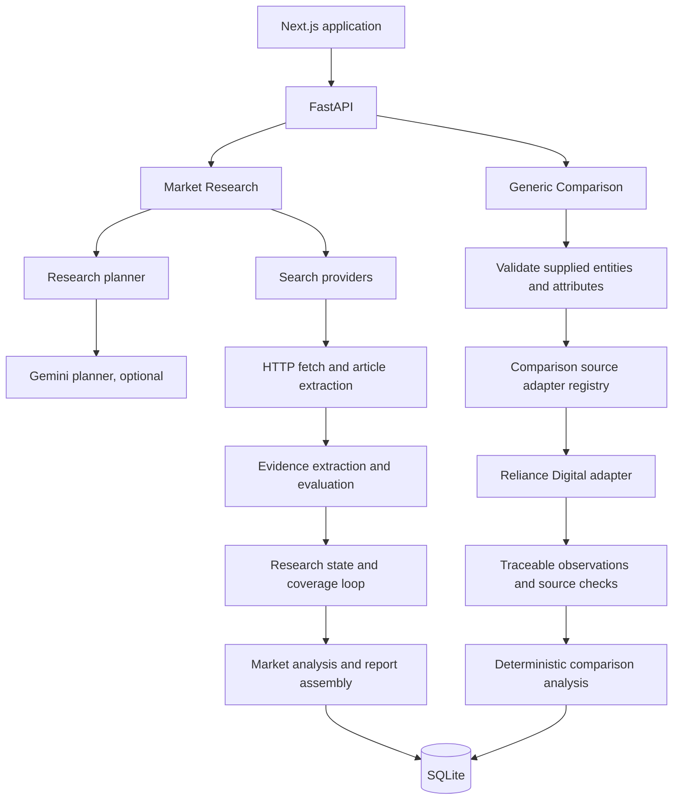

# MarketScoutAI

MarketScoutAI is an autonomous web research and market intelligence application with a separate, domain-independent comparison workflow. A user can research a market using fetched public sources and traceable evidence, or compare explicitly named entities using observations returned by selected source adapters.

The project combines a FastAPI backend, SQLite persistence, Python web-fetching and extraction tools, and a React/Next.js frontend. Gemini is an optional service used by the research planner to propose a structured plan; it is not used to generate comparison observations or comparison rankings.

## Capabilities

### Market Research

Submit a market question and follow a bounded research run. The system plans searches, discovers and fetches public pages, evaluates article-level evidence, checks requirement coverage, and may run targeted follow-up searches. It stores source metadata, evidence, activity, coverage, and the final report in SQLite.

### Generic Comparison

Submit a free-form comparison request together with entities, optional generic identifiers, attributes, and source preferences. The comparison service checks registered source adapters, stores source checks and observations separately from research evidence, then produces deterministic analysis from the stored observations.

The comparison domain model does not require product-specific fields. An adapter may require its own explicit identifiers; the currently registered Reliance Digital adapter uses product identifiers. The comparison service does not infer identifiers from an entity's display name.

## Architecture

The research and comparison workflows share the application shell and SQLite store, but have separate services, records, and result types.



## Research workflow

The research executor runs a bounded observe-and-evaluate loop:

```text
Research Request
  → Research Planner
  → Search Queries
  → Search / Fetch
  → Article Content Extraction
  → Evidence Extraction and Evaluation
  → Research State and Coverage Update
  → Follow-up Research when requirements remain missing
  → Market Analysis and Final Report
```

At each iteration, the executor searches the current queries, deduplicates URLs, fetches pages, evaluates sources, extracts candidate statements, selects evidence, and checks each information requirement against retained evidence. Missing requirements can produce targeted follow-up queries while budget remains. The report is assembled from the resulting evidence and coverage; it is not a claim that the web search was exhaustive.

### Research limits and stopping

- At most **3 research iterations** and **15 unique source URLs** per run.
- URLs and repeated query tasks are deduplicated.
- Research stops when all planned requirements are supported, when no further queries remain, when the source limit is reached, or when the iteration limit is reached.
- Search failures are skipped for that query, while page-fetch failures are attached to source records. The iteration and source limits prevent unbounded retrying.
- If the limits are reached before requirements are supported, the report preserves those gaps as unresolved / insufficient evidence.

The planner uses Gemini when `GEMINI_API_KEY` is configured and validates its structured response. If planning fails or Gemini is not configured, the planner uses a deterministic fallback plan. Some query scopes, including Indian smartphones under ₹30,000, receive a specific set of research requirements. Other questions use the planner output or fallback requirements.

### Evidence quality and scope

Search results are discovery leads. Research evidence is extracted from fetched, readable source pages, not accepted directly from a search-result snippet. Pages that cannot be fetched, have no readable content, or resolve only to a publisher homepage do not provide article evidence.

Search attempts use an optional configured SearXNG endpoint first, then Bing, direct Google search, and Google News RSS with wrapper-URL decoding as fallback. Provider access and returned results can vary.

The HTML extractor prefers article/main regions and removes common page chrome such as navigation, headers, footers, advertisements, cookie prompts, and many sidebar or news-widget regions. The evidence evaluator then applies heuristic checks, including:

- topic and product-category relevance;
- geographic relevance to the question;
- direct support for each information requirement;
- price-band and target-segment relevance where applicable;
- source class and publication date, including a claim's own year/date;
- complete, factual statement checks and rejection of obvious editorial, promotional, irrelevant, or incomplete text.

Retained research evidence keeps its exact source text and source metadata. Evidence is classified as `TARGET_SEGMENT`, `INDIA_MARKET_CONTEXT`, `GLOBAL_CONTEXT`, or `OUT_OF_SCOPE`. Broad/contextual evidence does not satisfy a direct target-segment requirement. Coverage, source quality, recency, geography, and conflict checks are heuristics; the system does not use an external reputation dataset or independently verify the original publisher's claims. Unsupported requirements remain visible as unresolved / insufficient evidence.

### Research persistence

Research data is stored in SQLite tables for runs, sources, evidence, and reports. Source rows retain discovery and fetch information; evidence rows retain the exact evidence text, source reference, publication metadata, relevance signals, and evidence scope. The default database file is `database/market_scout.sqlite3`; `MARKETSCOUT_DB` can point to another file.

## Generic comparison workflow

The current generic comparison API accepts a `ComparisonRequest`: the original request text, explicitly supplied entities, dynamic attributes, optional context, and source preferences. There is no automatic entity extraction or LLM-based comparison understanding step in the current workflow; the UI lets the user enter entities, identifiers, attributes, and sources directly.

```text
Comparison Request
  → Validate supplied entities, attributes, and source preferences
  → Run each selected registered source adapter
  → Persist source checks and accepted observations
  → Analyze the persisted observations deterministically
  → Return the comparison result
```

The generic model separates:

| Concept | Purpose |
|---|---|
| Entity | A request-local named entity, with optional generic identifiers and aliases |
| Attribute | A requested comparison dimension, such as a scalar, range, category, boolean, or structured value |
| Source reference | The identity of a source selected for checking |
| Source check | The result and diagnostics for checking one source |
| Observation | A value tied to an entity, attribute, and source |
| Analysis | A deterministic summary derived from persisted observations |

Observations preserve both `raw_value` and `normalized_value`, along with units/currency, observation time, source URL, and optional context. Raw observations are not research `Evidence` records. Missing or conflicting values are represented as unresolved; the system does not invent values when a source fails or cannot establish an exact match.

### Comparison statuses

Comparison lifecycle status and source-check status describe different things:

| Scope | Values | Meaning |
|---|---|---|
| Comparison | `queued`, `running`, `completed`, `failed` | State of the overall comparison request and orchestration |
| Source check | `pending`, `checked`, `partial`, `unavailable`, `blocked`, `failed`, `unsupported` | State of an individual requested source check |

`partial` means at least one requested entity yielded accepted observations while another entity could not be fully checked. Per-entity diagnostics remain available. A completed comparison can still contain unresolved attributes or failed/unsupported source checks.

### Current comparison source

Reliance Digital is the first registered generic comparison adapter. It is a source-specific bridge around the existing retailer fetcher; discovery and retailer parsing remain inside that adapter/fetcher rather than the generic comparison service. The bridge requires explicit entity identifiers sufficient to construct the retailer's product identity and does not derive those identifiers from `display_name`.

The underlying public-page fetcher uses the retailer's public product sitemap and targeted web-search fallback to discover candidate URLs. Candidate URL text is not treated as identity proof: product pages are fetched and must pass exact identity matching before an offer can become an observation. The adapter preserves matching/discovery diagnostics and maps accepted price and, when requested and available from a matched offer, storage into generic observations. Source URLs and timestamps remain attached. Unavailable, blocked, failed, unsupported, ambiguous, and not-found outcomes do not receive fabricated observations; not-found details are available through diagnostics.

Other public, official, retailer, or provider adapters can be added behind the generic source-adapter contract. They are not implemented merely because the generic models can represent them.

### Deterministic comparison analysis

`services/comparison_analysis.py` analyzes the persisted comparison result without network access or Gemini calls. It reports each entity's observed values and preserves source metadata. Missing observations and conflicting scalar observations remain unresolved; no value is selected to conceal a conflict.

Ranking is limited to complete, safely comparable scalar numeric values when the request supplies a supported `lower_is_better` or `higher_is_better` comparison rule. At least two entities must have usable values. Without a rule, values are shown without a ranking. Tied best values do not produce a single winner. The frontend displays the analysis returned by the backend and does not calculate rankings or winners.

### Generic comparison persistence

Generic comparison data uses separate SQLite tables: `comparison_runs`, `comparison_entities`, `comparison_attributes`, `comparison_source_checks`, and `comparison_observations`. Observations are linked to their comparison, entity, attribute, and source check. The existing `price_comparisons`, `price_retailer_checks`, and `price_observations` tables remain the legacy compatibility path.

## API

Start the API at `http://localhost:8000`. FastAPI's interactive API documentation is available at `http://localhost:8000/docs`.

### General endpoints

| Method | Endpoint | Purpose |
|---|---|---|
| `GET` | `/` | Basic API-running response and link to API docs |
| `GET` | `/health` | Health status |

### Research endpoints

| Method | Endpoint | Purpose |
|---|---|---|
| `POST` | `/research` | Accepts a question and queues a research run; returns HTTP 202, run ID, status, and status URL |
| `GET` | `/research/{research_id}` | Returns run details, activity, plan/coverage, evidence, and report content when available |
| `GET` | `/research/{research_id}/status` | Returns lifecycle status, iteration count, activity, update time, and error |
| `GET` | `/research/{research_id}/sources` | Returns source records and retained evidence |
| `GET` | `/research/{research_id}/report` | Returns the completed report, or 404 while no report is ready |

### Generic comparison endpoints

| Method | Endpoint | Purpose |
|---|---|---|
| `POST` | `/comparisons` | Accepts a generic comparison request, persists it, schedules background execution, and returns HTTP 202 with a comparison ID and status URL |
| `GET` | `/comparisons/{comparison_id}/status` | Returns comparison lifecycle status, timestamps, and errors |
| `GET` | `/comparisons/{comparison_id}` | Returns the complete result: request, entities, attributes, source checks, observations, analysis, unresolved information, errors, and timestamps |

The generic comparison lifecycle is asynchronous: submit with `POST`, poll the status endpoint while queued/running, then fetch the complete result. A requested source without a registered adapter is marked `unsupported` rather than returning invented observations.

### Legacy retailer price-comparison endpoints

The older product/retailer-specific compatibility path remains available:

| Method | Endpoint | Purpose |
|---|---|---|
| `POST` | `/price-comparisons` | Starts a legacy retailer price check |
| `GET` | `/price-comparisons/{comparison_id}/status` | Returns legacy comparison and retailer-check statuses |
| `GET` | `/price-comparisons/{comparison_id}` | Returns requested products, retailer checks, offers, and diagnostics |

This legacy contract is separate from the domain-neutral `/comparisons` API.

## Frontend

The Next.js application provides two modes in one shared interface:

- **Market Research** — submits a research question and displays run status, activity, requirements/coverage, sources, evidence, and the final report.
- **Compare** — submits a generic comparison request and displays backend analysis, entity/attribute values, unresolved information, observations, source checks, and traceable source links, timestamps, and context. The existing retailer price-check panel is also available as a separate compatibility workflow.

The generic comparison form supports multiple entities, arbitrary identifier key/value pairs, comparison attributes, and source selection. The UI does not infer identifiers or calculate its own winner/ranking. Set `NEXT_PUBLIC_API_URL` in the frontend environment to override the default backend URL (`http://localhost:8000`).

## Project structure

```text
MarketScoutAI/
├── agents/                  # Research planner and bounded executor
├── backend/                 # FastAPI application and routes
├── database/                # SQLite initialization and persistence
├── docs/                    # Documentation directory (currently empty)
├── frontend/
│   ├── app/                 # Next.js page, layout, and global styles
│   ├── components/          # Research, comparison, and price-check UI
│   ├── lib/api.ts           # Typed frontend API helpers
│   └── types/               # Research, generic comparison, and legacy types
├── models/                  # Research evidence and comparison contracts
├── services/                # Gemini planner adapter, comparison services/analysis
├── tests/
│   ├── fixtures/            # Saved retailer HTML fixtures
│   └── test_*.py            # Offline unit and API tests
├── tools/
│   ├── comparison_sources/  # Generic source contract and Reliance bridge
│   ├── retailer_fetchers/   # Legacy retailer adapters and parsing
│   ├── content_extractor.py
│   ├── web_fetcher.py
│   └── web_search*.py
├── requirements.txt
├── run.py
└── README.md
```

## Setup

### Backend

Use Python 3.10 or newer and create a virtual environment:

```powershell
cd C:\Projects\MarketScoutAI
python -m venv .venv
.venv\Scripts\Activate.ps1
python -m pip install -r requirements.txt
Copy-Item .env.example .env
```

Edit `.env` to configure `GEMINI_API_KEY` if Gemini planning is desired. `GEMINI_MODEL` defaults to `gemini-2.5-flash`. If no key is configured or the planner call fails, the research planner falls back to its deterministic plan. `SEARX_URL` is optional and configures a SearXNG search endpoint. `MARKETSCOUT_DB` is optional and changes the SQLite database path.

`tools/web_search.py` imports the `googlenewsdecoder` package, but that package is not currently listed in `requirements.txt`. A fresh environment may need it installed separately for the Google News RSS fallback:

```powershell
python -m pip install googlenewsdecoder
```

Keep `.env` private; it is ignored by Git. `.env.example` contains placeholders only. No real credentials belong in source control or this README.

### Frontend

Use Node.js and npm. From a second terminal:

```powershell
cd C:\Projects\MarketScoutAI\frontend
npm.cmd ci
npm.cmd run dev
```

For a different backend URL, create `frontend/.env.local` and set `NEXT_PUBLIC_API_URL` to the API origin.

## Run the project

Start the backend and frontend in separate PowerShell terminals.

**Terminal 1 — FastAPI backend**

```powershell
cd C:\Projects\MarketScoutAI
.venv\Scripts\Activate.ps1
uvicorn backend.main:app --reload
```

The API normally runs at `http://localhost:8000`; API docs are at `http://localhost:8000/docs`.

**Terminal 2 — Next.js frontend**

```powershell
cd C:\Projects\MarketScoutAI\frontend
npm.cmd run dev
```

Open `http://localhost:3000`. If port 3000 is occupied, Next.js selects another available port and prints the URL in its terminal.

## Testing and validation

The deterministic automated backend suite is under `tests/` and can be run offline:

```powershell
cd C:\Projects\MarketScoutAI
.venv\Scripts\Activate.ps1
python -m unittest discover -s tests -p "test_*.py" -v
python -m compileall agents backend database models services tools
```

Root-level `test_*.py` files are legacy smoke scripts; some call external services and are not the offline suite above.

Frontend checks:

```powershell
cd C:\Projects\MarketScoutAI\frontend
npx.cmd tsc --noEmit
npm.cmd run build
```

Before reviewing a change, run:

```powershell
git diff --check
```

The repository does not currently define a CI workflow. The project has been validated with deterministic backend tests, frontend TypeScript and production-build checks, and a manual end-to-end comparison through the public Reliance Digital adapter. Live web access is environment- and source-dependent, so live runs are not part of the deterministic unit test suite.

## Validated comparison example

A real end-to-end comparison was validated for an explicitly identified **OnePlus Nord 6 Fresh Mint**, with 8 GB RAM and 256 GB storage. The Reliance Digital adapter returned accepted price and storage observations with source URL, observation time, and discovery/matching diagnostics. A separate Nord 4 lookup did not find an exact product through available public discovery and returned no fabricated offer; unavailable values remained unresolved. These examples validate one adapter path and do not limit the generic comparison model to phones or electronics.

## Limitations

- Public search providers and retailer pages can change, rate-limit requests, block automated access, or require client-side JavaScript. Paywalls and access controls may prevent collection.
- Search-provider and source coverage depend on the public endpoints and adapters currently available. Reliance Digital is the only registered generic comparison adapter at present.
- The legacy price comparison remains product/retailer-specific; it is not the generic comparison contract.
- Comparisons run using FastAPI background tasks in the API process. There is no durable task queue or distributed worker, so this is not a production job-processing setup.
- The API currently has no authentication or user/account management. No production deployment configuration is included.
- Research source quality, relevance, coverage, and conflict decisions use heuristics. Results should be reviewed against the linked sources, and missing requirements may remain unresolved.
- A generic comparison cannot produce a verified observation if a selected source is unsupported, unavailable, blocked, fails, or does not provide an accepted matching value.

## Roadmap

Future work, not current functionality:

- Add generic source adapters for additional public sources, with offline fixtures and traceable observations.
- Expand deterministic integration tests across source and failure states.
- Add durable background job execution and deployment configuration if the application moves beyond local/demo use.
- Consider authentication, user isolation, and operational observability before exposing a hosted service.
- Improve demo documentation and repeatable portfolio/viva walkthroughs.

## Portfolio description

MarketScoutAI is a web research and comparison application built with FastAPI, Python, SQLite, and React/Next.js. Its research workflow plans bounded multi-query searches, fetches public pages, evaluates verbatim evidence, tracks unresolved requirements, and assembles a source-linked report. A separate domain-independent comparison workflow runs source adapters, stores raw and normalized observations with traceability, and analyzes complete numeric values deterministically when an explicit comparison rule is supplied. The project includes adapter boundaries, persistence and API tests, and frontend TypeScript/build validation.
